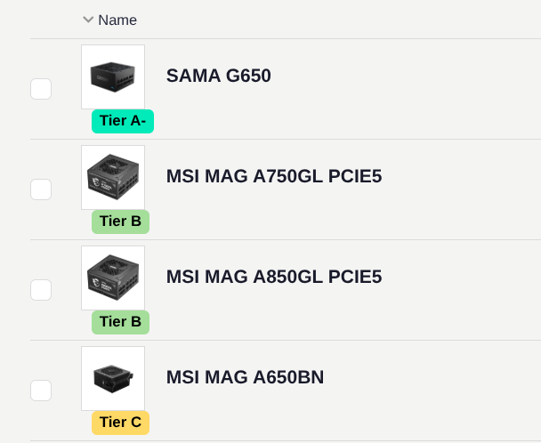
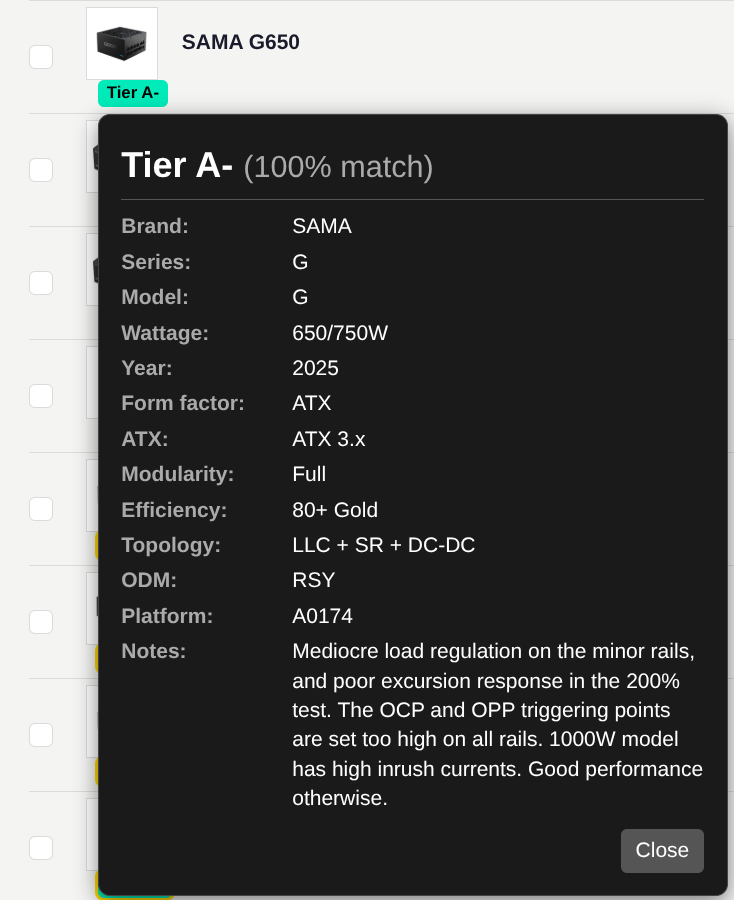
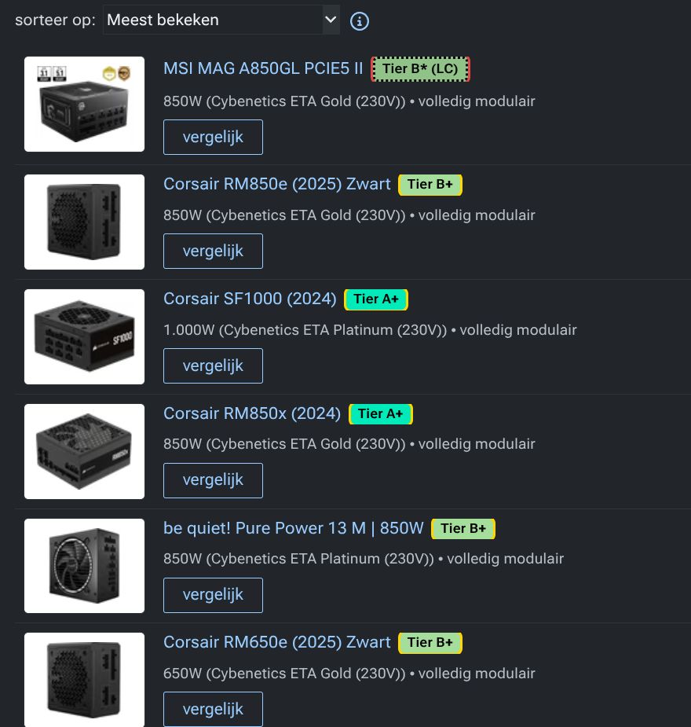

# PSU Tier List Userscript 🔌

[](https://addons.mozilla.org/en-US/firefox/addon/psu-tier-badges/)
[](https://chromewebstore.google.com/detail/psu-tier-badges-pcpartpic/ngjfcbgocgihemnfbfffikmcdpplhemf)
[](https://github.com/FeikoWielsma/psu-tier-userscript/actions)
[](https://github.com/FeikoWielsma/psu-tier-userscript/releases)
[](#-installation)
[](https://github.com/FeikoWielsma/psu-tier-userscript/blob/main/LICENSE)
[](https://github.com/astral-sh/ruff)
[](https://eslint.org/)

A tool that turns **SPL's PSU Tier List** (a Google Sheet) into a userscript that
injects coloured **Tier badges** directly onto power-supply listings on
**PCPartPicker** (all regions) and **Tweakers.net**, so you can judge PSU quality
at a glance.

Badges show match **confidence**: a solid badge is a confident match, a dashed
`Tier X?` badge is a *likely* match. Click any badge for full specs, the
confidence score, and other candidate matches.

> [!WARNING]
> Manufacturer naming is inconsistent across the tier sheet, PCPartPicker and
> Tweakers (and those three disagree with each other). The matcher is good but
> **false positives/negatives happen** — always confirm on the
> [official spreadsheet](https://docs.google.com/spreadsheets/d/1akCHL7Vhzk_EhrpIGkz8zTEvYfLDcaSpZRB6Xt6JWkc/htmlview)
> before buying. The badge confidence and "other possible matches" list are there
> to make disagreement visible rather than hidden.

## 🚀 Installation

The easiest way is the **official store listing** for your browser — one click,
with automatic updates. Prefer not to use a store? Manual and userscript options
are below.

### Option 1: Official browser stores (Recommended)

<table>
  <tr>
    <td align="center" width="50%">
      <a href="https://addons.mozilla.org/en-US/firefox/addon/psu-tier-badges/">
        <br>
        🦊 <b>Get it for Firefox</b>
      </a>
    </td>
    <td align="center" width="50%">
      <a href="https://chromewebstore.google.com/detail/psu-tier-badges-pcpartpic/ngjfcbgocgihemnfbfffikmcdpplhemf">
        <br>
        🟢 <b>Get it for Chrome</b>
      </a>
    </td>
  </tr>
</table>

- **Firefox** → [**Add to Firefox**](https://addons.mozilla.org/en-US/firefox/addon/psu-tier-badges/) from Mozilla Add-ons (AMO).
- **Chrome** → [**Add to Chrome**](https://chromewebstore.google.com/detail/psu-tier-badges-pcpartpic/ngjfcbgocgihemnfbfffikmcdpplhemf) from the Chrome Web Store.
- **Brave, Edge, Opera, Vivaldi & other Chromium browsers** → install straight
  from the **[Chrome Web Store](https://chromewebstore.google.com/detail/psu-tier-badges-pcpartpic/ngjfcbgocgihemnfbfffikmcdpplhemf)** link above — these browsers accept
  Chrome Web Store extensions directly. Notes:
  - **Brave**: open the Chrome Web Store link, click **Add to Brave**. If
    prompted, allow Chrome Web Store extensions (Brave enables this by default).
  - **Edge**: open the link in Edge; the first time you may see a banner to
    **Allow extensions from other stores** — click it, then **Add to Chrome →
    Add extension**.
  - **Opera**: install **[Install Chrome Extensions](https://addons.opera.com/extensions/details/install-chrome-extensions/)** first, then use the Chrome
    Web Store link.

---

### Option 2: Manual install (no store account / sideload)

#### Firefox
1. Go to the [**Releases**](https://github.com/FeikoWielsma/psu-tier-userscript/releases) page.
2. Download the signed `psutier-extension.xpi` file.
3. Open Firefox, drag and drop the `.xpi` file into the browser (or press `Ctrl+O` / `Cmd+O` and select it) to install it. No extension manager required!

#### Chrome / Brave / Edge
1. Download `psutier-extension.zip` from the [**Releases**](https://github.com/FeikoWielsma/psu-tier-userscript/releases) page and extract it.
2. Open `chrome://extensions`, `brave://extensions`, or `edge://extensions`.
3. Toggle **Developer mode** on (top-right).
4. Click **Load unpacked** and select the extracted folder.

---

### Option 3: Userscript (Requires Manager)

1. Install a userscript manager:
   - **Brave / Chrome / Edge** (Chromium): install **Violentmonkey** (or
     Tampermonkey) from the Chrome Web Store.
   - **Firefox**: install Violentmonkey/Tampermonkey from Add-ons.
2. **Brave/Chrome only — enable user scripts** (required since Chromium tightened
   Manifest V3): open the extension's *Details*, and turn on **"Allow User
   Scripts"** if shown; on older builds toggle **Developer mode** on
   `brave://extensions` instead. (One-time step.)
3. Download the latest `psutier.user.js` from the
   [**Releases**](https://github.com/FeikoWielsma/psu-tier-userscript/releases)
   page — your manager will offer to install it.

---

### Option 4: Tweakers custom CSS (no extension, Tweakers only)

Tweakers' own **custom CSS** carries the tier badges with no extension or
userscript manager at all — just enable the shared snippet:

> **▶ [Enable the snippet on Tweakers](https://tweakers.net/instellingen/customcss/snippets/bekijk/3538/)** — toggle it on and reload the Pricewatch.

It's **Tweakers Pricewatch only** (no PCPartPicker) and a static snapshot of the
tier list — new products / tier changes appear when the snippet is updated.

To (re)generate it yourself (or build a different variant), see
[`tools/README-tweakers-css.md`](tools/README-tweakers-css.md):

- **boxed** (default, ~40 KB) — filled tier pills, matching the extension's look.
- **lite** (~37 KB) — colored tier letter only.
- **popup** — pills **plus** a hover spec popup, abusing `::before` `content`.

---

Finally, visit a [PCPartPicker PSU listing](https://pcpartpicker.com/products/power-supply/) or the [Tweakers Pricewatch](https://tweakers.net/voedingen/vergelijken/) and look for the badges.

## 📸 Screenshots

### Badges on PCPartPicker


### Detail Specs Popup (after clicking badge)


### Badges on Tweakers.net


## 🧠 How it works

```
Google Sheet ──gviz CSV──► fetch_sheet.py ──► psu_tier.csv
                                              │
                          parse_tier_list.py ─┘──► psu_data.json
                                              │
        ┌── src/matcher.js  (matching engine, single source of truth)
        ├── src/adapters.js (per-site DOM extraction)
        ├── data/normalization_rules.json (declarative tuning)
        └── src/userscript.template.js (UI)
                                              │
                        generate_userscript.py ──► psutier.user.js
```

- **Data source** is the sheet's `gviz` **CSV export** (stable columns, no HTML
  scraping, no third-party Python deps).
- **Matching** (`src/matcher.js`) tokenizes the product name and each candidate
  model and scores a weighted token overlap. It also uses the storefront's
  **structured columns** as signals, not just the name: wattage and form factor
  (ATX vs SFX) are hard filters, and efficiency disambiguates variants. When a
  name is too thin to score on its own (e.g. "NZXT C750" → just "c"), those
  signals resolve it by constraint (wattage + efficiency + form factor). The
  winning score is the confidence shown on the badge. This is the **single
  source of truth** — the userscript and the test suite run the exact same code.
- There are **no hardcoded per-product hacks.** Naming quirks are fixed by
  editing data, not code (see below).

### Fixing a naming mismatch (the extension point)

Edit [`data/normalization_rules.json`](data/normalization_rules.json):

- `aliases` — rewrite incoming product names (e.g. ASUS `"850G"` → `"850 gold"`).
- `strip` — remove descriptors that differ across sources and never identify a
  model (ATX version tags, the `80+` prefix, …); applied to both sides.
- `generic` / `noise` — words that score low / are dropped.
- `thresholds` / `weights` — confidence bands and scoring balance.

Add a case to [`tests/corpus.json`](tests/corpus.json), run `npm test`, done.

### Supporting a new site

Add one entry to [`src/adapters.js`](src/adapters.js):
`{ id, match, selector, filter?, extract, insertBadge }`, where `extract(row)`
returns `{ name, wattage, efficiency, formFactor, modular }` (pull as many of
those from structured columns as the site exposes — the matcher uses them).

## 🛠️ Development

**Prerequisites:** Python 3 (standard library only) and Node.js 20+.
This repo uses [`uv`](https://docs.astral.sh/uv/) for Python.

```bash
git clone https://github.com/FeikoWielsma/psu-tier-userscript.git
cd psu-tier-userscript
npm install
```

Build + test (deterministic, no network — uses the committed data snapshot):

```bash
python test_suite.py        # build + lint + typecheck + run npm test
npm run check               # eslint + tsc --checkJs + tests
npm test                    # just the JS tests
npm run lint                # ESLint (src, tests, tools)
npm run typecheck           # tsc --checkJs (type inference, no JSDoc needed)
uvx ruff check .            # Python lint
```

Refresh data from the live sheet and rebuild:

```bash
python generate_userscript.py --update
```

### Testing

- **`npm test`** — offline, deterministic, CI-safe:
  - `tests/test_matching.js` runs the real matcher over `tests/corpus.json`
    (hand-labelled cases, incl. verbose real PCPP names) against the committed
    `tests/fixtures/sample_psu_data.json`.
  - `tests/test_adapters.js` runs the real adapters over saved HTML fixtures via
    `linkedom` — including full real PCPartPicker pages in
    `tests/fixtures/pcpp/` (100 rows each) to catch name/wattage extraction and
    DOM drift.
  - `tests/test_coverage.js` runs the matcher over ~900 real, deduplicated
    product names (`tests/fixtures/pcpp-products.json`) and asserts it never
    throws and overall match coverage stays above a floor. (A full listing
    includes many genuinely unrated units, so <100% is expected.)
- **Live browser** (local, on demand — never in CI):
  ```bash
  npx playwright install chromium          # once
  npm run capture                          # refresh tests/fixtures/*.html
  npm run smoke                             # inject the script, report matches
  # drive Brave instead of bundled Chromium:
  node tools/live_capture.mjs --smoke --browser-path "C:\\Program Files\\BraveSoftware\\Brave-Browser\\Application\\brave.exe" --headed
  ```
  These do a handful of normal page loads with pauses — not bulk scraping.

## 🤖 CI/CD

- **CI** (`.github/workflows/ci.yml`): runs `npm test` (the deterministic gate),
  does a non-fatal live fetch/parse structure check, then builds and uploads the
  userscript artifact.
- **Release** (`.github/workflows/release.yml`): pushing a `v*` tag runs the
  tests, builds from the latest sheet, and publishes a GitHub Release with
  `psutier.user.js`.

## 📜 Credits

- **Data**: [SPL's PSU Tier List](https://docs.google.com/spreadsheets/d/1akCHL7Vhzk_EhrpIGkz8zTEvYfLDcaSpZRB6Xt6JWkc/htmlview).
- **PCPartPicker** and **Tweakers.net** for the platforms this enhances.

---
*Not affiliated with PCPartPicker, Tweakers, or the spreadsheet maintainers.*
